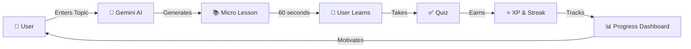

<div align="center">

# 🚀 NanoLearn


> 💡 **First time setup?** Generate your logo by opening `generate-logo.html` in your browser and clicking download!

### *AI-Powered Micro-Tutor in 60 Seconds* ⚡

[](https://reactjs.org/)
[](https://ai.google.dev/)
[](https://www.typescriptlang.org/)
[](https://vitejs.dev/)

[🎯 Features](#-features) • [🚀 Quick Start](#-quick-start) • [💡 How It Works](#-how-it-works) • [🎨 Screenshots](#-screenshots) • [🛠️ Tech Stack](#️-tech-stack)

---

</div>

## 🌟 What is NanoLearn?

**NanoLearn** transforms the way you learn by delivering **personalized, bite-sized lessons** in just **60 seconds**. Powered by **Google's Gemini 2.5 Flash AI**, it adapts to your learning style and generates custom content on any topic you want to master.

> 💡 *Perfect for busy learners who want to make every minute count!*

---

## ✨ Features

<table>
<tr>
<td width="50%">

### 🎯 **Smart Learning**
- **AI-Generated Lessons** - Custom content created instantly
- **Adaptive Difficulty** - Matches your skill level
- **Interactive Quizzes** - Test your knowledge in real-time
- **Progress Tracking** - Watch your XP grow

</td>
<td width="50%">

### 🔥 **Gamification**
- **Streak System** - Build daily learning habits
- **XP & Mastery Score** - Level up as you learn
- **Visual Progress** - Beautiful charts and rings
- **Achievement System** - Earn badges and rewards

</td>
</tr>
</table>

---

## 🚀 Quick Start

### Prerequisites

```bash
node >= 18.0.0
npm or yarn
```

### Installation

1️⃣ **Clone the repository**
```bash
git clone https://github.com/ABHIJATSARARI/NanoLearn.git
cd NanoLearn
```

2️⃣ **Install dependencies**
```bash
npm install
```

3️⃣ **Set up Gemini API Key**
```bash
# Create a .env file in the root directory
echo "VITE_GEMINI_API_KEY=your_api_key_here" > .env
```

> 🔑 Get your free API key from [Google AI Studio](https://makersuite.google.com/app/apikey)

4️⃣ **Start the development server**
```bash
npm run dev
```

5️⃣ **Open your browser**
```bash
http://localhost:5173
```

---

## 💡 How It Works



### 🎬 Learning Flow

1. **Choose Your Topic** 🎯 - Enter any subject you want to learn
2. **Select Difficulty** 📊 - Beginner, Intermediate, or Advanced
3. **Learn in 60s** ⏱️ - Digest bite-sized, AI-generated content
4. **Test Yourself** 🎓 - Take a quick quiz to reinforce learning
5. **Track Progress** 📈 - View your stats, streaks, and mastery scores

---

## 🎨 Screenshots

<div align="center">

### 🌊 Splash Screen
*Immersive entry experience with animated waves*

### 📊 Dashboard
*Track your learning journey with beautiful visualizations*

### 🧑‍🏫 Lesson Generator
*AI creates personalized content instantly*

### 📝 Quiz View
*Interactive questions with immediate feedback*

### 📈 Progress Analytics
*Detailed insights into your learning patterns*

</div>

---

## 🛠️ Tech Stack

<div align="center">

| Category | Technology |
|----------|-----------|
| **Frontend** | React 19.2, TypeScript 5.8 |
| **Build Tool** | Vite 6.2 |
| **AI Engine** | Google Gemini 2.5 Flash |
| **UI Icons** | Lucide React |
| **Charts** | Recharts 3.4 |
| **Styling** | Tailwind-inspired Custom CSS |
| **Storage** | LocalStorage API |

</div>

---

## 📂 Project Structure

```
NanoLearn/
├── 📄 App.tsx                 # Main application component
├── 📄 index.tsx              # Entry point
├── 📄 types.ts               # TypeScript definitions
├── 📁 components/
│   ├── Dashboard.tsx         # Main dashboard view
│   ├── LessonGenerator.tsx   # AI lesson creation
│   ├── MicroLessonView.tsx   # Lesson display
│   ├── QuizView.tsx          # Interactive quizzes
│   ├── ProgressRing.tsx      # Visual progress indicators
│   ├── SplashScreen.tsx      # App entry animation
│   ├── Navigation.tsx        # App navigation
│   └── TeacherDashboard.tsx  # Analytics view
├── 📁 services/
│   ├── geminiService.ts      # AI integration
│   └── storageService.ts     # Local data management
└── 📄 package.json           # Dependencies
```

---

## 🎮 Usage Examples

### Generate a Lesson

```typescript
// Enter any topic you're curious about
"Quantum Physics for Beginners"
"Spanish Verb Conjugation"
"React Hooks in 60 seconds"
"Machine Learning Basics"
```

### Track Your Progress

- **Streak Counter** - Maintains daily learning streaks
- **XP System** - Earn points for completing lessons
- **Mastery Score** - Overall proficiency tracking
- **Session History** - Review past lessons and scores

---

## 🌈 Key Highlights

<div align="center">

| Feature | Description |
|---------|-------------|
| ⚡ **Lightning Fast** | Lessons generated in seconds with Gemini 2.5 Flash |
| 🎨 **Beautiful UI** | Modern, responsive design with smooth animations |
| 🌓 **Dark Mode** | Automatic theme detection and toggle |
| 📱 **Mobile Ready** | Fully responsive on all devices |
| 💾 **Offline Storage** | Progress saved locally, no account needed |
| 🔒 **Privacy First** | All data stored on your device |

</div>

---

## 🎯 Roadmap

- [ ] 🌍 Multi-language support
- [ ] 📱 Native mobile apps (iOS & Android)
- [ ] 🤝 Social learning features
- [ ] 🏆 Advanced achievement system
- [ ] 📚 Lesson bookmarking and favorites
- [ ] 🔊 Audio lesson support
- [ ] 🎨 Custom theme builder

---

## 🤝 Contributing

Contributions are welcome! Feel free to:

1. 🍴 Fork the repository
2. 🌿 Create a feature branch (`git checkout -b feature/AmazingFeature`)
3. 💾 Commit your changes (`git commit -m 'Add AmazingFeature'`)
4. 📤 Push to the branch (`git push origin feature/AmazingFeature`)
5. 🔃 Open a Pull Request

---

## 📜 License

This project is open source and available under the MIT License.

---

## 👨‍💻 Author

**Abhijat Sarari**

- GitHub: [@ABHIJATSARARI](https://github.com/ABHIJATSARARI)

---

## 🙏 Acknowledgments

- 🤖 **Google Gemini AI** for powering the intelligent lesson generation
- ⚛️ **React Team** for the amazing framework
- ⚡ **Vite Team** for the blazing fast build tool
- 🎨 **Lucide** for beautiful icons
- 📊 **Recharts** for elegant data visualization

---

<div align="center">

### ⭐ Star this repo if you find it helpful!

**Made with ❤️ and ☕ by Abhijat Sarari**

[⬆ Back to Top](#-nanolearn)

</div>
